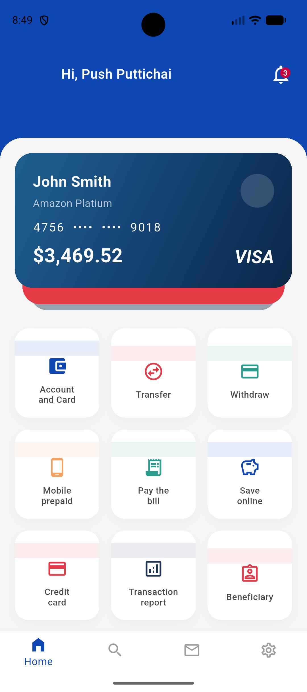
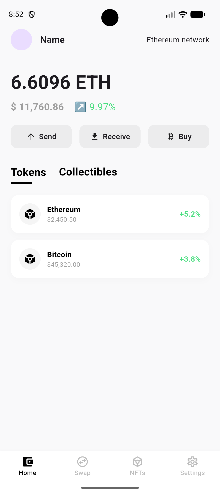
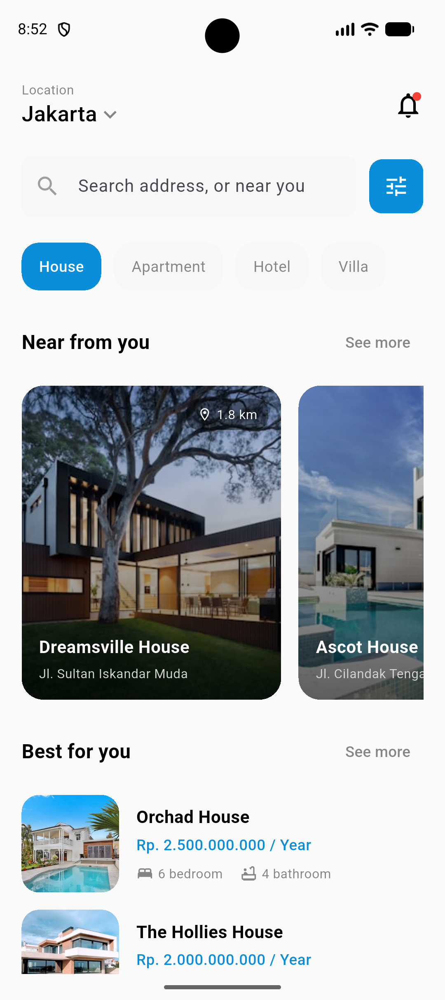
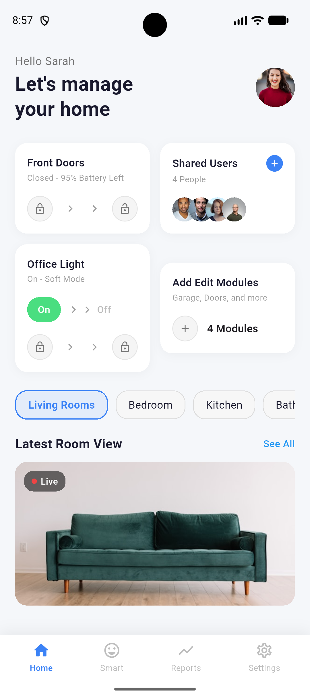
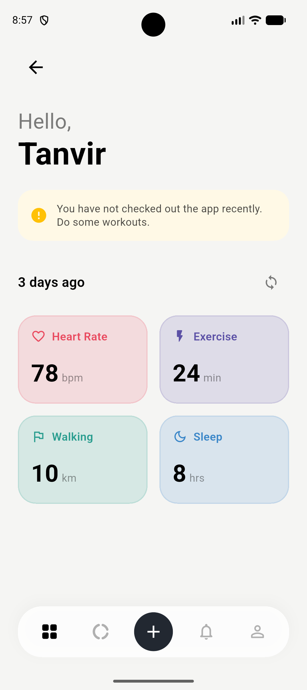
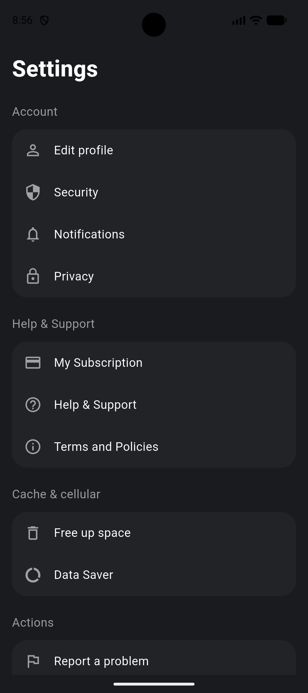

# figma_to_flutter

A Flutter project showcasing multiple UI screens 
converted from Figma designs to Flutter code.

## Screens

- 🏦 Bank Home — banking dashboard UI
- 💰 Crypto Home — cryptocurrency portfolio UI
- 🏠 Real Estate — property listing UI
- 🎵 Music Player — music streaming UI
- 🏡 Smart Home — smart home control UI
- ❤️ Vital Tracker — health tracking UI
- 👤 Profile — user profile UI
- ⚙️ Settings — app settings UI

## Tech Stack

- Flutter & Dart
- Custom widgets architecture
- Centralized color and text style constants

## Screenshots

  
  
  
  
  
  
  
  

## About

I built this project to practice converting 
Figma designs into clean Flutter UI code.
